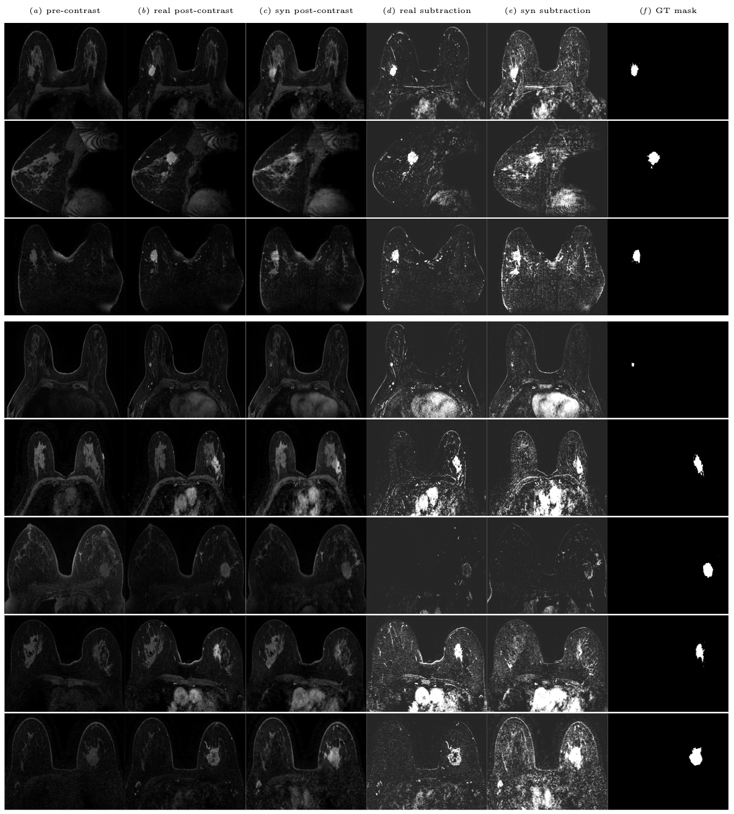

## [Pre- to Post-Contrast Breast MRI Synthesis for Enhanced Tumour Segmentation](https://arxiv.org/abs/2311.10879)

In SPIE Medical Imaging 2024.

## Getting Started
The [Duke Dataset](https://sites.duke.edu/mazurowski/resources/breast-cancer-mri-dataset/) used in this study is available on [The Cancer Imaging Archive (TCIA)](https://wiki.cancerimagingarchive.net/pages/viewpage.action?pageId=70226903).

You may find some examples of synthetic nifti files in [synthesis/examples](synthesis/examples).

### Synthesis Code
- [Config](synthesis/pix2pixHD/scripts/train_512p_duke_2D_w_GPU_1to195.sh) to run a training of the image synthesis model.
- [Config](synthesis/pix2pixHD/scripts/test_512p_duke_2D_w_GPU_1to195.sh) to run a test of the image synthesis model.
- [Code](synthesis/utils/convert_to_nifti_whole_dataset.py) to transform Duke DICOM files to NiFti files.
- [Code](synthesis/utils/nifti_png_conversion.py) to extract 2D pngs from 3D NiFti files.
- [Code](synthesis/utils/png_nifti_conversion.py) to create 3D NiFti files from axial 2D pngs.
- [Code](synthesis/utils/get_training_patient_ids.py) to separate synthesis training and test cases.
- [Code](synthesis/utils/metrics.py) to compute the image quality metrics such as SSIM, MSE, LPIPS, and more. 
- [Code](synthesis/utils/fid.py) to compute the Frèchet Inception Distance (FID) based on ImageNet and [RadImageNet](https://github.com/BMEII-AI/RadImageNet).  

### Segmentation Code
- [Code](nnUNet/custom_scripts/convert_data_to_nnunet_204.py) to prepare 3D single breast cases for nnunet segmentation.
- [Train-test-splits](nnUNet/nnunetv2/nnUNet_preprocessed/Dataset208_DukePreSynthetic/splits_final_pre_post_syn.json) of the segmentation dataset.
- [Script](nnUNet/custom_scripts/full_pipeline.sh) to run the full nnunet pipeline on the Duke dataset.

## Acknowledgements
This repository borrows code from the [pix2pixHD](https://github.com/NVIDIA/pix2pixHD) and the [nnUNet](https://github.com/MIC-DKFZ/nnUNet) repositories. The 254 tumour segmentation masks used in this study were provided by [Caballo et al](https://doi.org/10.1002/jmri.28273).
